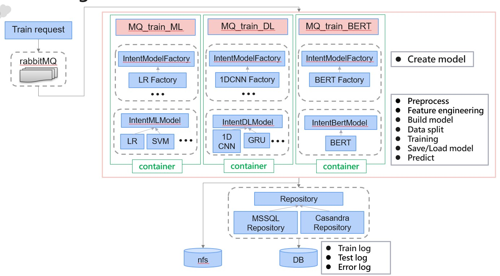

 
* **檔案說明**  
* **模型訓練的部分demo code, 並非完整專案**   
FlaskApi_HelperIntentModel_Train.py : flask撰寫的API , 用於模型訓練   
FlaskApi_Check_HelperIntentModel.py : 檢查API參數的decorators  
NLP_IntentPreprocessing.py : 前處理通用程式(結巴斷詞, 資料前處理......)  
NLP_IntentModelFactory.py : 模型建立工廠  
NLP_IntentDLModel.py : 深度學習模型(使用Keras)  
NLP_IntentMLModel.py : 機器學習模型(使用scikit-learn)  
NLP_IntentBertModel.py : Bert模型(使用pytorch-pretrained-bert)  
notebook_ML_intent_training.ipynb : 訓練模型實驗程式    

