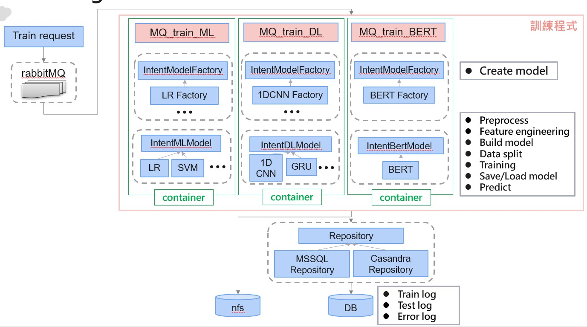

 
# 檔案說明  
* **只展示方便閱讀的demo code**   
FlaskApi_HelperIntentModel_Train.py : flask撰寫的API , 用於模型訓練   
FlaskApi_Check_HelperIntentModel.py : 檢查API參數的decorators  
NLP_IntentPreprocessing.py : 前處理通用程式(結巴斷詞, 資料前處理......)  
NLP_IntentModelFactory.py : 模型建立工廠  
NLP_IntentDLModel.py : 深度學習模型(使用Keras)  
NLP_IntentMLModel.py : 機器學習模型(使用scikit-learn)  
NLP_IntentBertModel.py : Bert模型(使用pytorch-pretrained-bert)  
notebook_ML_intent_training.ipynb : 訓練模型實驗程式    

* **完整的流程會如下圖**  
1. 前端送出訓練request後, 將訓練需求送至Queue  
2. 依照演算法的不同送至不同的監聽程式並訓練   
3. 不同演算法會分類並建立於不同的docker container  
4. 每個container中的訓練程式以工廠模式產生演算法  
5. 每個演算法必須實作其介面, 如圖灰框所示
6. 訓練完成後會將訓練log存入資料庫
7. model存入nfs

